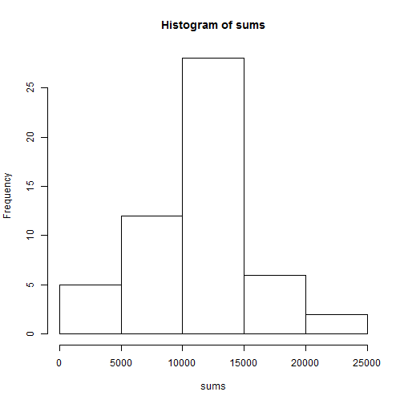
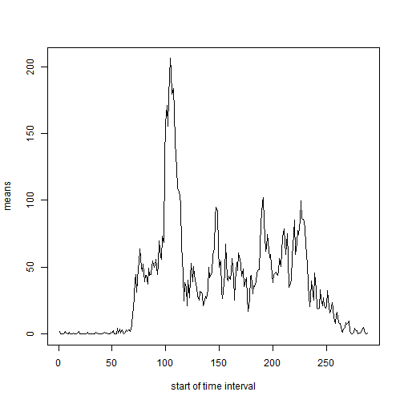
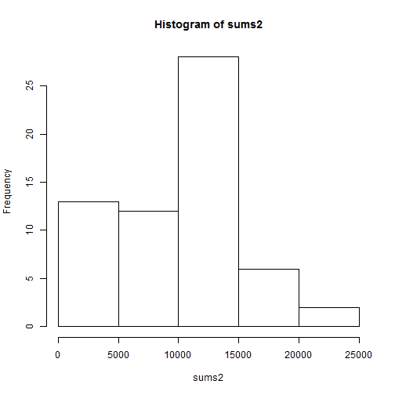
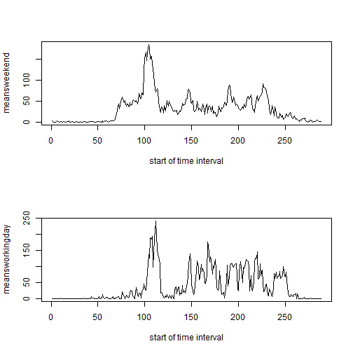

In first step we read and adjust our data to contatin values of type date.


```r
Sys.setlocale(category = "LC_ALL", locale = "C")
```

```
## [1] "C"
```

```r
data <- read.csv("activity.csv")
data$date <- as.Date(data$date)
```


For first part of our assignment we exclude missing values from our data.


```r
subnafree <- !is.na(data$steps)
datanafree <- data[subnafree, ]
```


We plot the histogram of total sum of steps for each day.

```r
sums <- tapply(datanafree$steps, datanafree$date, sum)
hist(sums)
```

 


Next we compute mean and median of the total sum of steps.

```r
mean(sums)
```

```
## [1] 10766
```

```r
median(sums)
```

```
## [1] 10765
```


We also compute and plot the average number of steps made in 5-minute intervals. The means are computed across all days in the data set. We also report the start of time interval for which the average number of steps is maximum.

```r
means <- tapply(datanafree$steps, datanafree$interval, mean)
t <- rep("", 288)
for (i in 1:24) {
    for (j in 1:12) {
        t[(i - 1) * 12 + j] = paste(as.character(i - 1), ":", as.character((j - 
            1) * 5), sep = "")
    }
}
par(mfrow = c(1, 1))
plot(means, type = "l", xlab = "start of time interval")
```

 

```r
t[which(means == max(means))]
```

```
## [1] "8:35"
```


For the second part of the assignmennt we adjust the data by replacing the missing values by the average number of steps for relevant time interval.
First we compute number of missing values in the data.


```r
sum(is.na(data$steps))
```

```
## [1] 2304
```

```r
steps <- data$steps
for (i in 1:length(steps)) {
    if (is.na(steps[i])) 
        (steps[i] = means[(data$interval[i]%%288)/5 + 1])
}
dataadjust <- data
dataadjust$steps <- steps
```


We again plot the histogram of total sum of steps taken each day (obtained from adjusted data) and compute mean and median of these values.


```r
sums2 <- tapply(dataadjust$steps, dataadjust$date, sum)
par(mfrow = c(1, 1))
hist(sums2)
```

 

```r
mean(sums2)
```

```
## [1] 9378
```

```r
median(sums2)
```

```
## [1] 10395
```

We see that replacing the missing values has impact on our statistics. Both mean and median are less now and they are not so close to each other.

For the final part of the assignment we separate data into two groups - weekends and working days. We compare the average number of steps made in every time interval for both groups.

```r
days <- weekdays(data$date)
workingday <- (days != "Saturday") & (days != "Sundays")
w <- as.factor(workingday)
levels(w) = c("weekend", "workingdy")
dataweekdays <- dataadjust[workingday, ]
dataweekends <- dataadjust[!workingday, ]
meansweekend <- tapply(dataweekdays$steps, dataweekdays$interval, mean)
meansworkingday <- tapply(dataweekends$steps, dataweekends$interval, mean)
par(mfrow = c(2, 1))
plot(meansweekend, type = "l", xlab = "start of time interval")
plot(meansworkingday, type = "l", xlab = "start of time interval")
```

 

